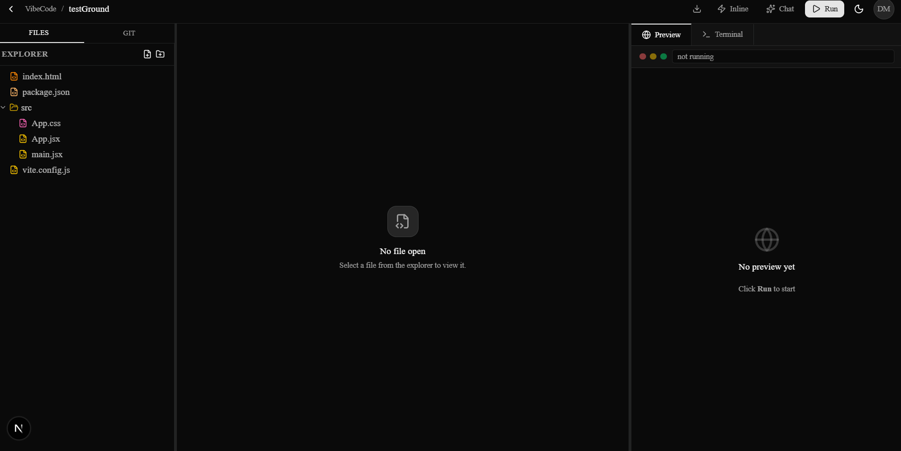
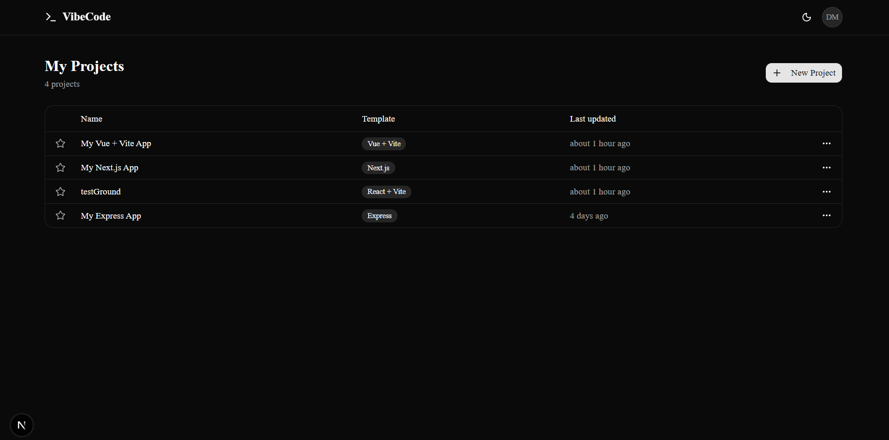
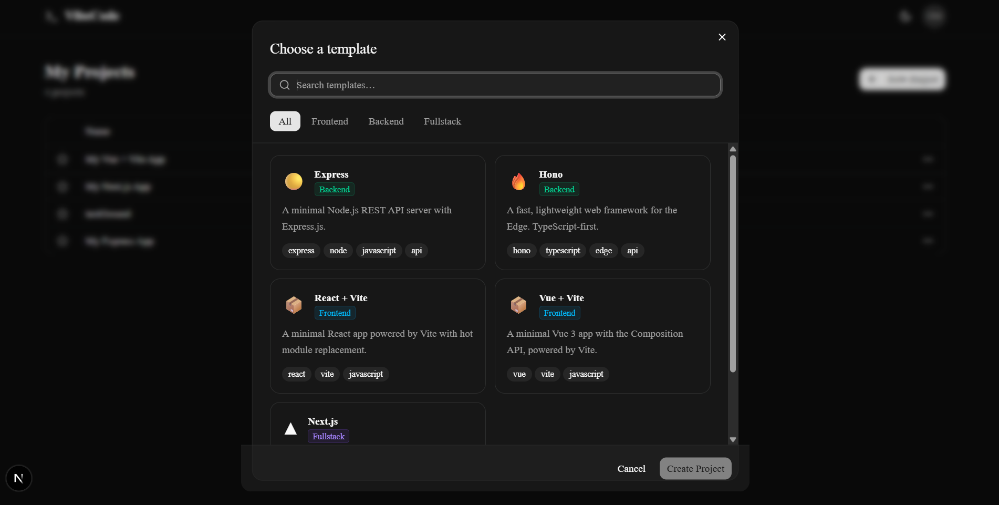
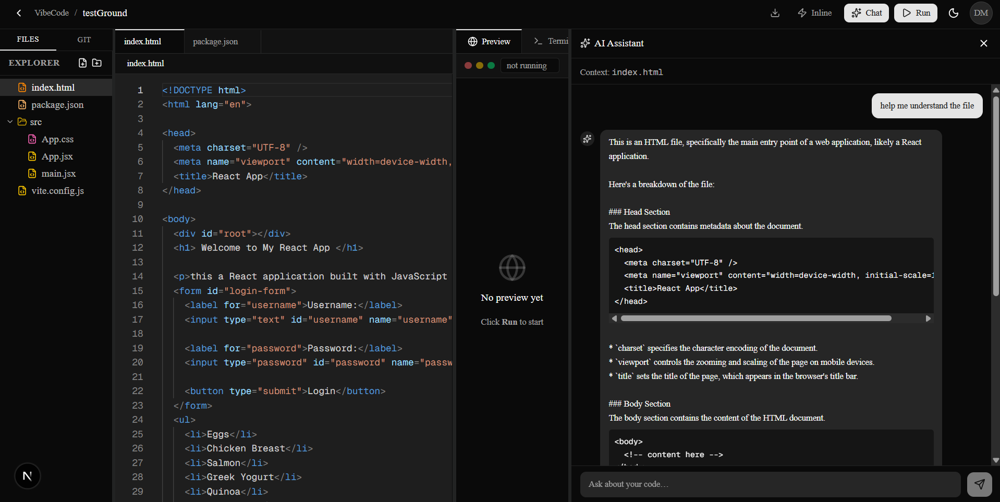
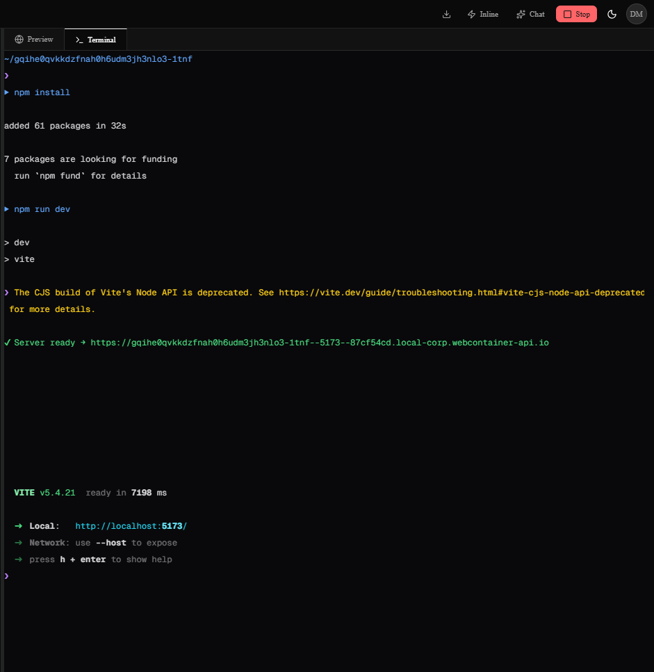
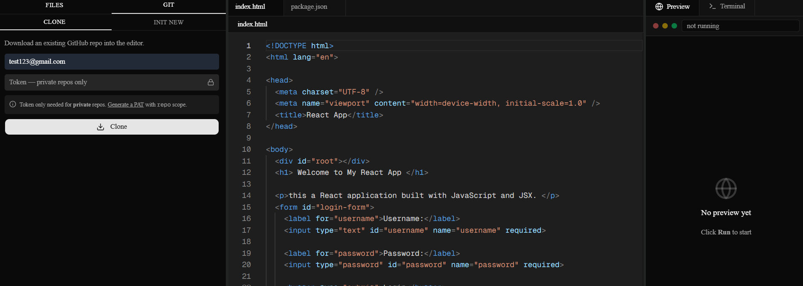
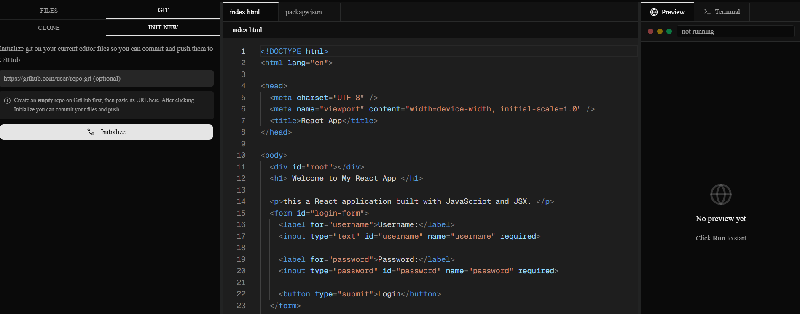

# VibeCode Editor

> An AI-powered web IDE that runs entirely in the browser — no local setup, no installs, no servers.

Write code, run it live, chat with an AI assistant, and sync to GitHub — all inside a single browser tab.

**Live demo:** [vibecode-editor-debarshi.vercel.app](https://vibecode-editor-debarshi.vercel.app)



---

## Screenshots

| Dashboard | Template Picker |
|---|---|
|  |  |

| Playground | AI Chat Assistant |
|---|---|
|  |  |

| Terminal | Git — Clone / Init |
|---|---|
|  |  |

| Git — Commit & Push | |
|---|---|
|  | |

---

## Features

### Authentication
- Sign in with **Google** or **GitHub** OAuth
- Account linking — same email across providers merges into one account
- Protected routes (`/dashboard`, `/playground`) via NextAuth middleware

### Dashboard
- View all your coding playgrounds in a clean table
- **Create** from a template, **rename**, **duplicate**, **favorite** (star), **delete**
- Empty state with a direct CTA to create your first project

### Template System
- 5 starters: **React + Vite**, **Vue + Vite**, **Express**, **Hono**, **Next.js**
- Filter by category (Frontend / Backend / Fullstack) and search by name
- Templates stored in MongoDB Atlas, seeded via `npm run seed`

### Playground — Full In-Browser IDE
- **Monaco Editor** — VS Code's editor engine with syntax highlighting for TS, JS, JSX, TSX, JSON, CSS, HTML, Python, Vue, and more; language auto-detected from file extension; theme syncs with dark/light toggle; bracket-pair colorization
- **File Explorer** — collapsible folder tree, inline create / rename / delete, unsaved-change dot indicator on editor tabs, Ctrl+S saves to MongoDB
- **WebContainer** — runs your Node.js app entirely in the browser; mounts files, streams `npm install` + `npm run dev` output to the terminal, fires a server-ready event to populate the live preview
- **Live Preview** — iframe with browser chrome and reload button; updates as your code changes
- **xterm.js Terminal** — full interactive shell connected to WebContainer's `jsh`; clipboard paste, backspace, ANSI colours, `TERM=xterm-256color` for clean readline behaviour
- **Resizable panels** — drag the dividers between the file explorer, editor, and preview/terminal panels to whatever layout you prefer

### AI Features
- **Inline autocomplete** — ghost-text suggestions as you type, powered by Groq; Tab to accept, Ctrl+Space to trigger manually; toggle on/off independently via the ⚡ button in the header
- **AI Chat Assistant** — resizable sidebar (drag the edge to resize); context-aware — sends the currently open file with every message; streams responses token by token; code blocks have **Copy** and **Insert at cursor** buttons
- Powered by **Groq** in production (`llama-3.3-70b-versatile`) — fast, free tier, no credit card needed

### GitHub Integration
- **Clone** any public repo (or private with a PAT) directly into the editor
- **Init New** — initialize git on your existing editor files and connect to an empty GitHub repo
- Stage all changes, write a commit message, and **Commit**
- **Push** and **Pull** with a GitHub Personal Access Token (stored in session only, never persisted to the server)
- Changed-file list shows Modified / Added / Deleted indicators
- All git operations run entirely in the browser via **isomorphic-git** + LightningFS (IndexedDB)

### Download as ZIP
- Click the ↓ button in the header to download all project files as a `.zip` — preserves folder structure, no server needed, works offline

### Light / Dark Mode
- Dark by default; toggle in the header; Monaco editor theme syncs automatically

---

## Tech Stack

| Layer | Technology |
|---|---|
| Framework | Next.js 16.2 (App Router) |
| Language | TypeScript 5, strict mode |
| UI | React 19, shadcn/ui (55 components, radix-nova), Tailwind CSS v4 |
| Icons | Lucide React |
| Database | MongoDB Atlas via Prisma ORM 7 |
| Auth | NextAuth.js v5 — Google + GitHub OAuth |
| Theme | next-themes |
| Editor | Monaco Editor (`@monaco-editor/react`) |
| Runtime | WebContainers API (`@webcontainer/api`) |
| Terminal | xterm.js (`@xterm/xterm`, `@xterm/addon-fit`, `@xterm/addon-web-links`) |
| AI | Groq API — `llama-3.3-70b-versatile` (prod) / Ollama (local dev) |
| Git | isomorphic-git + `@isomorphic-git/lightning-fs` |
| ZIP | jszip |
| Panels | react-resizable-panels |
| Notifications | sonner |
| Deployment | Vercel + MongoDB Atlas (free tier) |

---

## Getting Started

### Prerequisites
- Node.js 20+
- A MongoDB Atlas account (free M0 cluster)
- Google and GitHub OAuth apps
- A Groq API key (free at [console.groq.com](https://console.groq.com))

### Install & run locally

```bash
npm install
npx prisma generate
npm run dev
```

Open [http://localhost:3000](http://localhost:3000).

### Environment variables

Create a `.env.local` file at the project root:

```env
DATABASE_URL=mongodb+srv://...          # MongoDB Atlas connection string
NEXTAUTH_SECRET=...                     # openssl rand -base64 32
NEXTAUTH_URL=http://localhost:3000
GOOGLE_CLIENT_ID=...
GOOGLE_CLIENT_SECRET=...
GITHUB_CLIENT_ID=...
GITHUB_CLIENT_SECRET=...
GROQ_API_KEY=gsk_...                    # Free at console.groq.com
```

### Seed templates

```bash
npx prisma db push
npm run seed
```

---

## Deployment

Deployed on **Vercel** + **MongoDB Atlas**.

### Vercel setup
1. Import the GitHub repo at [vercel.com/new](https://vercel.com/new)
2. Framework is auto-detected as Next.js
3. Override the **Build Command** to:
   ```
   npx prisma generate && next build
   ```
4. Add all environment variables (same as above, with `NEXTAUTH_URL` set to your Vercel domain)
5. Deploy — takes ~2 minutes

### Post-deploy
- Update `NEXTAUTH_URL` to your Vercel domain and redeploy
- Add the Vercel callback URLs to your Google and GitHub OAuth apps:
  - `https://your-app.vercel.app/api/auth/callback/google`
  - `https://your-app.vercel.app/api/auth/callback/github`
- Run `npm run seed` locally (with Atlas `DATABASE_URL`) to seed templates

> **Note:** WebContainers require Cross-Origin-Isolation headers (`COOP: same-origin` + `COEP: require-corp`). These are already configured in `next.config.ts` and apply to all routes automatically.

---

## Roadmap

- [x] Phase 1 — Auth & DB schema (NextAuth v5, Prisma models, protected routes)
- [x] Phase 2 — Landing page + dark mode
- [x] Phase 3 — Dashboard (project table, CRUD, favorites)
- [x] Phase 4 — Template system (seed data, picker modal, project bootstrapping)
- [x] Phase 5 — Playground layout (resizable 3-panel, header, preview/terminal tabs)
- [x] Phase 6 — File explorer (create/rename/delete, unsaved indicators)
- [x] Phase 7 — Monaco Editor (syntax highlighting, language detection, theme sync)
- [x] Phase 8 — WebContainer + live preview (boot, install, dev server, iframe)
- [x] Phase 9 — Terminal (xterm.js + WebContainer shell, ANSI colours, npm output streaming)
- [x] Phase 10 — AI features (Groq inline autocomplete + streaming chat assistant with Insert at cursor)
- [x] Phase 11 — Deployment (Vercel + MongoDB Atlas)
- [x] Bonus — ZIP download + GitHub integration (clone, init, commit, push, pull via isomorphic-git)
